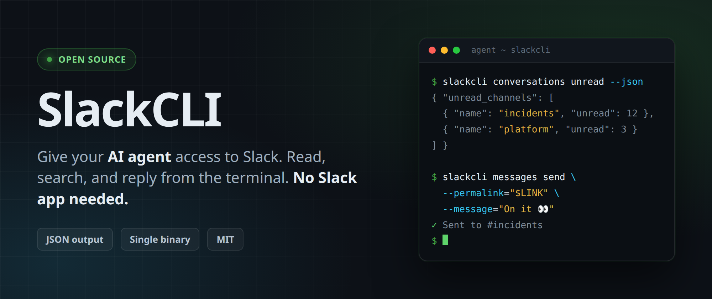
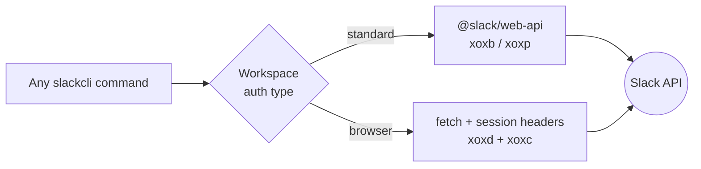

<div align="center">



### Work with one — or many — Slack workspaces, straight from your terminal.

Read channels, send messages, search history, and catch up on what you missed.
Built to be **AI-agent friendly**, so your scripts and assistants can use Slack too.
No Slack app to build, no admin approval to wait for.

[](https://github.com/shaharia-lab/slackcli/releases/latest)
[](https://github.com/shaharia-lab/slackcli/actions/workflows/ci.yml)
[](https://github.com/shaharia-lab/slackcli/releases)
[](https://github.com/shaharia-lab/slackcli/stargazers)
[](LICENSE)
[](https://github.com/shaharia-lab/slackcli/commits/main)

**[Quickstart](#-quickstart) · [What it does](#-what-do-you-want-to-do) · [Commands](#-command-reference) · [Docs](docs/README.md) · [Contributing](#-contributing)**

<br>

### ⭐ Like the idea? [Star the repo.](https://github.com/shaharia-lab/slackcli)

It takes two seconds, and it is how the next person finds SlackCLI.

</div>

---

## 🎬 See it in action

Sign in, browse conversations, search the workspace, read a thread from a permalink,
reply, react, read a canvas as Markdown, and pipe `--json` into `jq` — all from the terminal.

https://github.com/user-attachments/assets/90cf1c89-2859-4b84-a731-b0ff3e1172f3

> [!IMPORTANT]
> **Unofficial project.** SlackCLI is not affiliated with, endorsed by, or supported by
> Slack Technologies. Slack ships an [official CLI](https://docs.slack.dev/tools/slack-cli/)
> for building Slack apps — this is a different tool, for driving a workspace you already
> belong to.

---

## ⚡ Quickstart

Three steps, about a minute.

<details open>
<summary><b>1. Install</b> — pick your platform</summary>

<br>

**Homebrew** (macOS & Linux) — recommended

```bash
brew tap shaharia-lab/tap
brew install slackcli
```

<details>
<summary>Linux — direct binary</summary>

```bash
# x86_64
curl -L https://github.com/shaharia-lab/slackcli/releases/latest/download/slackcli-linux -o slackcli

# arm64
curl -L https://github.com/shaharia-lab/slackcli/releases/latest/download/slackcli-linux-arm64 -o slackcli

chmod +x slackcli && mkdir -p ~/.local/bin && mv slackcli ~/.local/bin/
```

</details>

<details>
<summary>macOS — direct binary</summary>

```bash
# Intel
curl -L https://github.com/shaharia-lab/slackcli/releases/latest/download/slackcli-macos -o slackcli

# Apple Silicon
curl -L https://github.com/shaharia-lab/slackcli/releases/latest/download/slackcli-macos-arm64 -o slackcli

chmod +x slackcli && mkdir -p ~/.local/bin && mv slackcli ~/.local/bin/
```

</details>

<details>
<summary>Windows</summary>

Download `slackcli-windows.exe` from the [latest release](https://github.com/shaharia-lab/slackcli/releases/latest)
and put it somewhere on your `PATH`.

</details>

<details>
<summary>From source (Bun)</summary>

```bash
git clone https://github.com/shaharia-lab/slackcli.git
cd slackcli
bun install
bun run build        # -> ./dist/slackcli
```

</details>

Every release ships `checksums.txt` — verify your download if you care to, and you should.
Full details in the [installation guide](docs/user-guide/installation.md).

</details>

<details open>
<summary><b>2. Sign in</b> — one command, no Slack app required</summary>

<br>

```bash
slackcli auth login-auto
```

A browser opens, you sign into Slack as you normally would, and SlackCLI captures the
session tokens for **every workspace on that account**. Nothing leaves your machine.

Prefer a real Slack app token, or need a service account? There are three other ways —
see [authentication](#-authentication-two-kinds-of-credentials) below.

</details>

<details open>
<summary><b>3. Do something useful</b></summary>

<br>

```bash
slackcli conversations unread                       # what did I miss?
slackcli search messages "deploy failed" --in=engineering
slackcli messages send --permalink="$LINK" --message="On it 👀"
```

</details>

> [!TIP]
> Anywhere SlackCLI wants a channel ID or a timestamp, you can paste a **Slack link**
> instead. Copy a permalink out of the Slack app and hand it straight to the CLI —
> see [links & timestamps](docs/user-guide/links-and-timestamps.md).

---

## 🧭 What do you want to do?

| I want to… | Try this | Learn more |
|---|---|---|
| See what I missed | `slackcli conversations unread` | [conversations](docs/user-guide/conversations.md) |
| Read a channel or a thread | `slackcli conversations read C123 --limit=50` | [conversations](docs/user-guide/conversations.md) |
| Send, reply, edit, or react | `slackcli messages send --permalink="$LINK" --message="…"` | [messages](docs/user-guide/messages.md) |
| Search the workspace | `slackcli search messages "release notes"` | [search](docs/user-guide/search.md) |
| Find a channel or a person | `slackcli search people "ada"` | [search](docs/user-guide/search.md) |
| Work through "saved for later" | `slackcli saved list --state=to_do` | [saved items](docs/user-guide/saved.md) |
| Read a Canvas as Markdown | `slackcli canvas read F123` | [canvas](docs/user-guide/canvas.md) |
| Upload a file with a message | `slackcli messages send --file=./report.pdf …` | [messages](docs/user-guide/messages.md) |
| Post rich Block Kit content | `slackcli messages send --blocks=@blocks.json …` | [messages](docs/user-guide/messages.md) |
| Script it / feed an AI agent | `… --json \| jq` | [scripting & JSON](docs/user-guide/scripting.md) |
| Juggle several workspaces | `slackcli conversations list --workspace=automation-bot` | [workspaces](docs/user-guide/workspaces.md) |
| Fix something that broke | `slackcli auth list` | [troubleshooting](docs/user-guide/troubleshooting.md) |

---

## 🤖 Built to be scripted

Every command that returns data speaks `--json`, and so do the commands that write —
`messages send`, `edit`, and `draft` echo back what they just wrote. SlackCLI drops
straight into shell pipelines, cron jobs, CI steps, and AI agent toolchains.

```bash
# Who is talking about the outage, and when?
slackcli search messages "outage" --in=incidents --json \
  | jq -r '.matches[] | "\(.username)\t\(.text)"'

# Turn today's unreads into a digest
slackcli conversations unread --json | jq '[.unread_channels[] | {name, unread_count}]'

# Read a thread, summarise it elsewhere, reply with the result
slackcli conversations read --permalink="$LINK" --json | jq '.messages[].text'

# Post, then keep the handle so a later step can edit or react
sent=$(slackcli messages send --recipient-id=C123 --message="Deploying…" --json)
slackcli messages react --permalink="$(jq -r .permalink <<<"$sent")" --emoji=eyes
```

No Slack app, no OAuth dance, no webhook server — just a binary and a token.
Patterns, exit codes, and pagination are in [scripting & JSON output](docs/user-guide/scripting.md).

---

## 🔐 Authentication: two kinds of credentials

SlackCLI talks to Slack either as a **Slack app** (`xoxb-*` / `xoxp-*`) or as a
**signed-in browser session** (`xoxd-*` + `xoxc-*`). One `SlackClient` abstracts both.



<details>
<summary><b>Four ways to sign in</b> — and which one to pick</summary>

<br>

| Method | Command | Best for |
|---|---|---|
| **Automatic browser login** | `slackcli auth login-auto` | Almost everyone. Sign in once, all workspaces enrolled. |
| **Slack app token** | `slackcli auth login --token=xoxb-… --workspace-name="My Team"` | Bots, CI, service accounts, long-lived automation. |
| **Parse a DevTools cURL** | `slackcli auth parse-curl --login` | Locked-down browsers, or when you already copied the request. |
| **Browser tokens by hand** | `slackcli auth login-browser --xoxd=… --xoxc=… --workspace-url=…` | Full control, or scripted provisioning. |

Browser session tokens can create **drafts**, which a Slack app simply cannot do, and
they back `saved list` and `conversations unread` with Slack's own native endpoints
rather than approximations. Slack app tokens are more stable and survive a browser logout.

`slackcli auth extract-tokens` prints the manual walkthrough.
The security model, the OAuth scopes each command needs, and what `login-auto` does with
your browser profile are all in the [authentication guide](docs/user-guide/authentication.md).

</details>

<details>
<summary><b>Where credentials live</b></summary>

<br>

Configuration lives in `~/.config/slackcli/` (directory mode `0700`):

| File | Contents |
|---|---|
| `workspaces.json` | Workspace credentials (mode `0600`) |
| `update-check.json` | Cached update check, refreshed at most daily |
| `browser-profile/` | The browser profile used by `auth login-auto` |

`workspaces.json` and `browser-profile/` both hold **live credentials** — do not commit,
sync, or share them. `slackcli auth logout` clears both.

</details>

---

## 📖 Command reference

Seven command groups. `slackcli <group> --help` always prints the authoritative options
for the version you have installed.

<details>
<summary><code>auth</code> — sign in, manage workspaces</summary>

<br>

| Command | Does |
|---|---|
| `auth login-auto` | Sign in through a browser; captures tokens automatically |
| `auth login` | Sign in with a standard Slack app token (`xoxb-*` / `xoxp-*`) |
| `auth login-browser` | Sign in with browser session tokens (`xoxd-*` + `xoxc-*`) |
| `auth parse-curl` | Extract tokens from a cURL command copied out of DevTools |
| `auth extract-tokens` | Print the manual token-extraction guide |
| `auth list` | List authenticated workspaces |
| `auth set-default <workspace>` | Choose the default workspace |
| `auth remove <workspace>` | Remove one workspace |
| `auth logout` | Remove all workspaces and the stored browser profile |

📄 [authentication](docs/user-guide/authentication.md) · [workspaces & profiles](docs/user-guide/workspaces.md)

</details>

<details>
<summary><code>conversations</code> — channels, DMs, threads, unreads</summary>

<br>

```bash
slackcli conversations list --types=public_channel
slackcli conversations read C1234567890 --limit=50
slackcli conversations read --permalink="$LINK"          # reads that message's thread
slackcli conversations get C1234567890 1234567890.123456
slackcli conversations unread
```

📄 [conversations](docs/user-guide/conversations.md)

</details>

<details>
<summary><code>messages</code> — send, reply, edit, react, draft</summary>

<br>

```bash
slackcli messages send --recipient-id=C1234567890 --message="Hello team!"
slackcli messages send --permalink="$LINK" --message="On it"      # replies in-thread
slackcli messages send --recipient-id=C123 --file=./report.pdf --message="Latest numbers"
slackcli messages send --recipient-id=C123 --blocks=@blocks.json
slackcli messages send --recipient-id=C123 --message-file=./release-notes.md
slackcli messages send --recipient-id=C123 --message="Done" --json   # {channel_id, ts, permalink}
slackcli messages react --permalink="$LINK" --emoji=+1
slackcli messages edit --channel-id=C123 --timestamp=1234567890.123456 --message="Corrected"
slackcli messages draft --recipient-id=C123 --message="Draft for later"
```

> [!NOTE]
> `messages draft` requires browser session tokens — Slack apps cannot create drafts.

📄 [messages](docs/user-guide/messages.md)

</details>

<details>
<summary><code>search</code> — messages, channels, people</summary>

<br>

```bash
slackcli search messages "deploy failed" --in=engineering --from=ada --limit=50
slackcli search channels "incident"
slackcli search people "ada@example.com"
```

📄 [search](docs/user-guide/search.md)

</details>

<details>
<summary><code>saved</code> · <code>canvas</code> · <code>update</code></summary>

<br>

```bash
slackcli saved list --state=to_do            # saved | to_do | completed
slackcli canvas list --channel=C1234567890
slackcli canvas read F1234567890             # Canvas -> Markdown
slackcli update check                        # is there a newer version?
slackcli update                              # install it
```

📄 [saved items](docs/user-guide/saved.md) · [canvas](docs/user-guide/canvas.md)

</details>

---

## ⭐ Spread the word

Made it this far? Then SlackCLI is probably useful to you — and the fastest way to
keep it alive is to make it easier for the next person to find.

<div align="center">

**[⭐ Star SlackCLI](https://github.com/shaharia-lab/slackcli)** ·
**[💬 Say hello in Discussions](https://github.com/shaharia-lab/slackcli/discussions)** ·
**[🐛 Report something broken](https://github.com/shaharia-lab/slackcli/issues)**

<br>

**Share it with one person who lives in Slack and in a terminal**

[](https://twitter.com/intent/tweet?text=SlackCLI%20%E2%80%94%20work%20with%20one%20or%20many%20Slack%20workspaces%20straight%20from%20your%20terminal%2C%20and%20let%20AI%20agents%20do%20it%20too.&url=https%3A%2F%2Fgithub.com%2Fshaharia-lab%2Fslackcli)
[](https://www.linkedin.com/sharing/share-offsite/?url=https%3A%2F%2Fgithub.com%2Fshaharia-lab%2Fslackcli)
[](https://bsky.app/intent/compose?text=SlackCLI%20%E2%80%94%20work%20with%20one%20or%20many%20Slack%20workspaces%20straight%20from%20your%20terminal%2C%20and%20let%20AI%20agents%20do%20it%20too.%20https%3A%2F%2Fgithub.com%2Fshaharia-lab%2Fslackcli)
[](https://www.reddit.com/submit?url=https%3A%2F%2Fgithub.com%2Fshaharia-lab%2Fslackcli&title=SlackCLI%20%E2%80%94%20work%20with%20one%20or%20many%20Slack%20workspaces%20straight%20from%20your%20terminal)
[](https://news.ycombinator.com/submitlink?u=https%3A%2F%2Fgithub.com%2Fshaharia-lab%2Fslackcli&t=SlackCLI%20%E2%80%94%20work%20with%20one%20or%20many%20Slack%20workspaces%20straight%20from%20your%20terminal)

</div>

In rough order of usefulness:

- ⭐ **Star the repo** — the single highest-leverage thing.
- 🐛 **Open an issue** when something breaks or a command feels wrong.
- 💬 **Tell one person** who lives in Slack and in a terminal.
- ✍️ **Write about it** — a blog post, a work Slack message, a comment on HN or Reddit.
- 🛠️ **Send a PR** — see [Contributing](#-contributing) below.

<details>
<summary>Star history</summary>

<br>

<a href="https://star-history.com/#shaharia-lab/slackcli&Date">
  <picture>
    <source media="(prefers-color-scheme: dark)" srcset="https://api.star-history.com/svg?repos=shaharia-lab/slackcli&type=Date&theme=dark" />
    
  </picture>
</a>

</details>

---

## 📚 Documentation

Everything lives in [`docs/`](docs/README.md).

<table>
<tr>
<td valign="top" width="50%">

**User guide** — how to *use* it

- [Installation](docs/user-guide/installation.md)
- [Authentication](docs/user-guide/authentication.md)
- [Workspaces & profiles](docs/user-guide/workspaces.md)
- [Slack links & timestamps](docs/user-guide/links-and-timestamps.md)
- [Conversations](docs/user-guide/conversations.md)
- [Messages](docs/user-guide/messages.md)
- [Search](docs/user-guide/search.md)
- [Saved items](docs/user-guide/saved.md)
- [Canvas](docs/user-guide/canvas.md)
- [Scripting & JSON output](docs/user-guide/scripting.md)
- [Troubleshooting](docs/user-guide/troubleshooting.md)

</td>
<td valign="top" width="50%">

**Developer docs** — how to *work on* it

- [Development setup](docs/development/setup.md)
- [Architecture](docs/development/architecture.md)
- [Project structure](docs/development/project-structure.md)
- [Testing](docs/development/testing.md)
- [Build & release](docs/development/build-and-release.md)
- [Adding a command](docs/development/adding-a-command.md)

<br>

```bash
bun install
pre-commit install     # same checks CI runs
bun run dev --help     # run from source
bun test               # 400+ tests
bun run type-check
bun run build          # -> ./dist/slackcli
```

</td>
</tr>
</table>

---

## 🤝 Contributing

Contributions are very welcome — and the process here is a little stricter than most
repos, on purpose.

> [!IMPORTANT]
> **Open an issue first, and wait for the `ready-for-pr` label.** That label is how the
> maintainer decides which features belong in the CLI, and it locks the feature to your
> PR so nobody duplicates your work. A workflow enforces the issue link.

1. **[Open an issue](https://github.com/shaharia-lab/slackcli/issues/new)** describing
   **WHAT** the change is, **WHY** it is needed, and optionally **HOW**.
2. Wait for triage and the **`ready-for-pr`** label.
3. Fork, branch, and open a PR that **links the issue** (`Closes #123`).
4. Make sure type-check, tests, and pre-commit hooks pass, and that your commits are
   **signed**.

Looking for a place to start? Try
[`good first issue`](https://github.com/shaharia-lab/slackcli/issues?q=is%3Aissue+is%3Aopen+label%3A%22good+first+issue%22)
or [`help wanted`](https://github.com/shaharia-lab/slackcli/issues?q=is%3Aissue+is%3Aopen+label%3A%22help+wanted%22).

The full policy is in [CONTRIBUTING.md](CONTRIBUTING.md) and [CLAUDE.md](CLAUDE.md).
Security issues go through [SECURITY.md](SECURITY.md) — never a public issue.

### Contributors

<a href="https://github.com/shaharia-lab/slackcli/graphs/contributors">
  
</a>

---

## 💬 Support

- 🐛 [Report a bug or request a feature](https://github.com/shaharia-lab/slackcli/issues)
- 💬 [Discussions](https://github.com/shaharia-lab/slackcli/discussions)
- 🔒 [Security policy](SECURITY.md)
- 📧 support@shaharia.com

## 📄 License

[MIT](LICENSE) — do what you like, no warranty.

Built with [Bun](https://bun.sh) · powered by [@slack/web-api](https://slack.dev/node-slack-sdk/) ·
inspired by [gscli](https://github.com/shaharia-lab/gscli)

<div align="center">
<br>

**Made with ❤️ by [Shaharia Lab](https://github.com/shaharia-lab)**

⭐ [Star SlackCLI](https://github.com/shaharia-lab/slackcli) if it made your day a little shorter.

</div>
